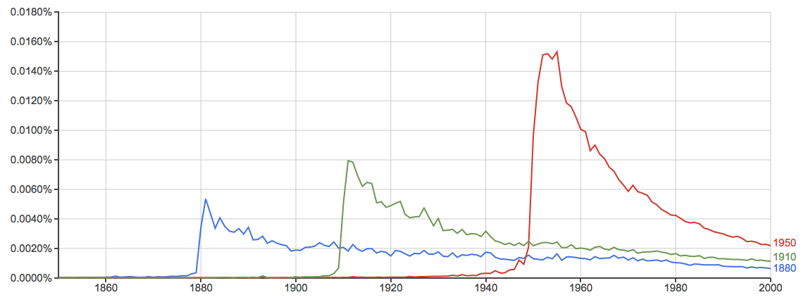

# Replicate and extend part of Michel et al 2011

## a) Setup

Set up your R working environment. You'll need to have the following packages installed:

- data.table
- bit64

You can run the script `import.R` to download and preprocess all relevant data.
The script will create two files, `ngrams.RData` and `counts.RData` that we will import.
For your convenience, we have provided these data files in the `data/` subdirectory.

```{r, include=FALSE}
setwd("~/Princeton/SOC725/Code/lab-2")
load("~/Data/ngram//ngrams.RData")
load("~/Data/ngram//counts.RData")
````

```{r, message=FALSE}
# Load packages
require(data.table)
require(bit64)

# Import data (generated with import.R)
# These data sets are subsets of the Google Ngram Viewer data sets by Google,
# licensed under CC BY 3.0 (http://creativecommons.org/licenses/by/3.0/).
# We extracted the years 1800-1999 for all languages as well as their total counts.
load("data/ngrams.RData")
load("data/counts.RData")

# Years of interest
years_of_interest <- c(1880, 1910, 1950)
languages <- c("eng", "chi-sim", "fre", "ger", "heb", "ita", "rus", "spa")

```


Let's take a quick look at the total counts of the different datasets. We see a big difference in the number of total words between english and all the other languages.


```{r, out.width = '1000px'}
par(mfrow = c(2, 4))
for(lang in languages) {
  plot(counts[[lang]][year > 1800]$year, counts[[lang]][year > 1800]$match_count, type = "l", lwd = 2, col = "blue", main = lang, xlab = "Year", ylab = "Total mention count", ylim = c(0, 2e10))
}
```

## b) Recreating Figure 3a

First, we plot the frequency of usage of the ngrams `1880`, `1910` and `1950` in the english dataset.
Frequency means the ratio between the ngrams' match count in a year to that year's total match count.

```{r}

# get match counts for ngrams and handle missing counts 
get_match_counts <- function(ds, years, xrange, replaceNA = TRUE) {
  lapply(years, function(y) {
    get_single_match_count(ds, y, xrange, replaceNA)
  })
}
get_single_match_count <- function(ds, y, xrange, replaceNA = TRUE) {
  # years we have
  d1 <- ds[ngram == y & year %in% xrange]
  # years we expect
  d2 <- data.table(year = xrange)
  # introduce NA for missing years
  d <- merge(d1, d2, by = "year", all = T)
  # replace all NA with 0
  if(replaceNA) {
    d[is.na(d$match_count)]$match_count <- 0  
  }
  d$match_count
}

# plot the frequency of usage of certain ngrams over the years
plot_frequency <- function(ds, cts, years, relative = TRUE, xrange = 1850:2000) {
  # get counts for ngrams
  match_counts <- get_match_counts(ds, years, xrange)
  
  # if we calculate frequencies, divide counts by yearly total match counts
  if (relative) {
    freq <- cts[year %in% xrange]$match_count
    divide_by_frequency <- function(x) {x / freq}
    match_counts <- lapply(match_counts, divide_by_frequency)
  }
  
  # parameters for the plot
  max_y <- max(sapply(match_counts, max))
  clrs <- rainbow(length(years))
  
  # plot the first year
  plot(xrange, match_counts[[1]], type = "l", col = clrs[1], ylim = c(0, max_y), lwd = 2, xlab = "Year", ylab = ifelse(relative, "Frequency", "Mention count"))
  
  # now all other years
  if (length(years) > 1) {
    for (i in 2:length(years)) {
      lines(xrange, match_counts[[i]], col = clrs[i], lwd = 2)
    }
  }
  legend("topleft", legend = years, lty=c(1,1), lwd=2, col = rainbow(length(years)), bty = "n")
}

plot_frequency(ngrams[["eng"]], counts[["eng"]], years_of_interest)

```

We can see that the spikes have increased over time and also they seem to drop off more sharply in later years, which is similar to the results in the original paper.

## c) Google NGram Viewer

Comparing our graph against the graph created using the NGram Viewer shows that we haven't made any mistakes so far. Good!




## d) Raw Mention count

Let's plot the raw mention count instead:

```{r}
plot_frequency(ngrams[["eng"]], counts[["eng"]], years_of_interest, relative = F)
```

## e) Comparison

*Does the difference between (b) and (d) lead to reevaluate any of the results of Michel et al. (2011).  Why or why not?*

We can see that while the frequency drops sharply after the initial spike (which often happened to be shortly after the actual year), the absolute mentions stay relatively stable and increase again after a number of years. This is most probably due to the large increase in the number of documents scanned by Google Ngram in the last years (cf. the plots in a)).
It is hard to argue about these different trends without knowledge about the composition of the Ngram corpus itself, and hence hard to derive any conclusions about whether society is actually *forgetting* faster about years in the past.
After all, this might just be due to the composition of the corpus.

## f) Halflifes

Next, we plot the halflifes of *year* ngrams in the english dataset.
This means, for each year (e.g., 1991, 1992, ...) we calculate how long it took for the frequency after its usage peaked to fall back to half of its peak value.
The thick line in the plots represents a two-sided moving average with a window of 21 years.
Note, that we might not have match counts for all years and thereby might encounter a lot of missing halflifes, especially in other languages.

```{r}

plot_halflife <- function(ds, cts, xrange = 1850:2000, plotrange = 1870:1980) {
  
  halflife <- sapply(plotrange, function(y) {
    # select frequencies for year y
    f <- get_single_match_count(ds, y, xrange, replaceNA = F) / cts[year %in% xrange]$match_count
    # select time range after max
    ts <- f[(which.max(f)):length(f)]
    hl_value <- ts < (max(ts) / 2)
    # find first value below half, substract one because R indexing starts at one
    c(y, match(T, hl_value) - 1)
  })

  # convert into data table
  halflifes <- data.table(matrix(unlist(halflife)[1:202], nrow=101, byrow=T))
  setnames(halflifes, c("year", "hl"))
  plot(halflifes$year, halflifes$hl, col="gray", ylim = c(0, max(halflifes$hl[!is.na(halflifes$hl)])), pch=16, ylab="Half-life (yrs)", xlab="Year")

  # moving average code from http://stackoverflow.com/a/4862334
  ma <- function(x, n=21){filter(x,rep(1/n,n), sides=2)}
  lines(1875:1975, ma(halflifes$hl)[6:106], lwd=3)
}

plot_halflife(ngrams[["eng"]], counts[["eng"]])
```

The halflife for years in the English corpus does not exhibit the same trend shown in the paper by Michel et al, instead of declining it stays relatively constant over time.

## Replicating the graphs for other languages

### Chinese
```{r, echo = FALSE}
plot_frequency(ngrams[["chi-sim"]], counts[["chi-sim"]], years_of_interest)
plot_halflife(ngrams[["chi-sim"]], counts[["chi-sim"]])
```

The Chinese dataset is likely too small to produce meaningful plots.

### French
```{r, echo = FALSE}
plot_frequency(ngrams[["fre"]], counts[["fre"]], years_of_interest)
plot_halflife(ngrams[["fre"]], counts[["fre"]])
```

We see similar spikes in the French dataset as we saw in the English dataset, however with much lower halflifes.

### German
```{r, echo = FALSE}
plot_frequency(ngrams[["ger"]], counts[["ger"]], years_of_interest)
plot_halflife(ngrams[["ger"]], counts[["ger"]])
```

In the German dataset, the spikes are more similar to each other and the halflifes are lower than in the English version.

### Hebrew
```{r, echo = FALSE}
plot_frequency(ngrams[["heb"]], counts[["heb"]], years_of_interest)
plot_halflife(ngrams[["heb"]], counts[["heb"]])
```

The Hebrew dataset is likely too small to produce meaningful plots.

### Italian
```{r, echo = FALSE}
plot_frequency(ngrams[["ita"]], counts[["ita"]], years_of_interest)
plot_halflife(ngrams[["ita"]], counts[["ita"]])
```

The Italian dataset shows similar spikes for all three years and rather low halflifes.

### Russian
```{r, echo = FALSE}
plot_frequency(ngrams[["rus"]], counts[["rus"]], years_of_interest)
plot_halflife(ngrams[["rus"]], counts[["rus"]])
```

The Russian dataset produces a bigger spike for 1950 than for the other years, and rather low halflifes.

### Spanish
```{r, echo = FALSE}
plot_frequency(ngrams[["spa"]], counts[["spa"]], years_of_interest)
plot_halflife(ngrams[["spa"]], counts[["spa"]])
```

The spikes in the Spanish dataset look similar to those in the English dataset, but has rather low halflifes.
